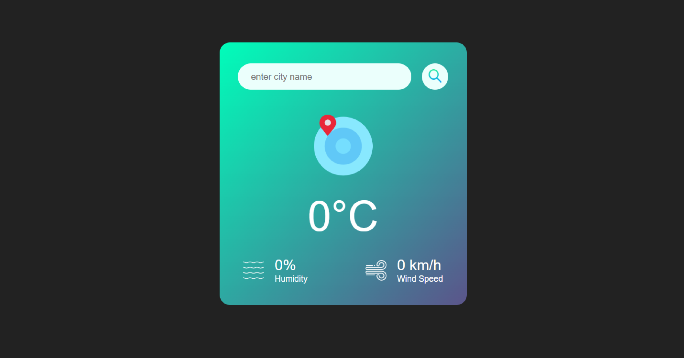
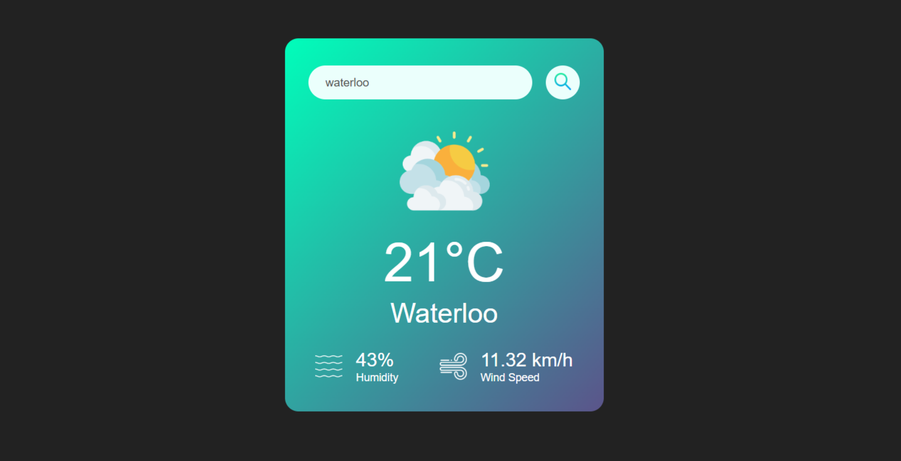

# SIMPLE WEATHER APP

Simple weather app built with HTML, CSS, and JavaScript. It makes use of a free weather API provided by "openweathermap.org". Feel free to use this codebase for personal or commercial use cases.  

---
#### Landing Page State [NEW]
  

#### Landing Page State [OLD]
  

#### Page State for Valid City Name

#### Page State for Invalid City Name
  

---
MIT LICENSE  

---